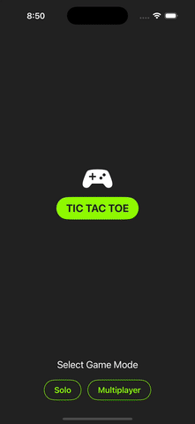

# 🎯 Tic-Tac-Toe (SwiftUI)

A modern **Tic-Tac-Toe** game built with **SwiftUI**, featuring:
- **Solo Mode** (play against an AI)
- **Multiplayer Mode** (play with a friend on the same device)
- **Adjustable AI Difficulty** (Easy, Medium, Hard)

---

## 🎬 Preview Demo

---

## ✨ Features
- **🎮 Solo Mode** – Play against an AI with adjustable difficulty.
- **🤝 Multiplayer Mode** – Two players on the same device.
- **⚡ SwiftUI UI** – Smooth animations and a clean, minimal design.
- **🔄 Instant Restart** – Restart a match at any time.

---

## 🛠️ Tech Stack
- **Language:** Swift
- **Framework:** SwiftUI
- **AI Logic:** Minimax Algorithm with difficulty adjustment
